# Professional-Portfolio

## Description

This project was a whole lot of fun despite its challenging nature. It was amazing to see the concepts and codes learned from class coming together in my Portfolio. My motivation was my increased understanding of HTML and CSS from the beginning of the course. 

I built this project to create a strong Portfolio via both back-end and front-end coding. Seeing how they integrate is definitely satisfying. As for this project it was purposeful as this is a lifetime website that will allow us to showcase our work allowing businesses to contact us or review and employ us in the future. 

This project solves the issue of not having a document that shows all your work without having to use multiple documents to showcase your work. It therefore allows you to have a prefessional page that provides ease of access to those who want to view your work.

Working through this project I learned a myriad of codes to enhace the design of your portfolio, despite my lack of completing the prompt as I was not able to figure out a few tasks. I personally struggled in the linking task as I wasn't sure what code goes for that specific task.

Finally, what makes my project stand are the sof tone colors used and font that is easy to read. 

## Update

I was able to alter the screensizes and input my first group project within my Portfolio. However, I still struggled in linking the menu attributes to their respective pages. 

## Installation

Step 1: Create your HTML and CSS. Link your CSS to your HTML.

Step 2: Draw your Layout to get an idea of how you want your Portfolio page to look. (Navigation bar, About, Work/Project, Contact)

Step 3: Start on your HTML to get the items on the page in order. (Section by Section)

Step 4: Use CSS to input your design from your sketched drawing of your website.

Step 5: Link the items in the Navigation bar to their section.

Step 6: Ensure page is visible on all screen-sizes. (Use CSS)

Step 7: Congratulate yourself and share your website!

## Usage

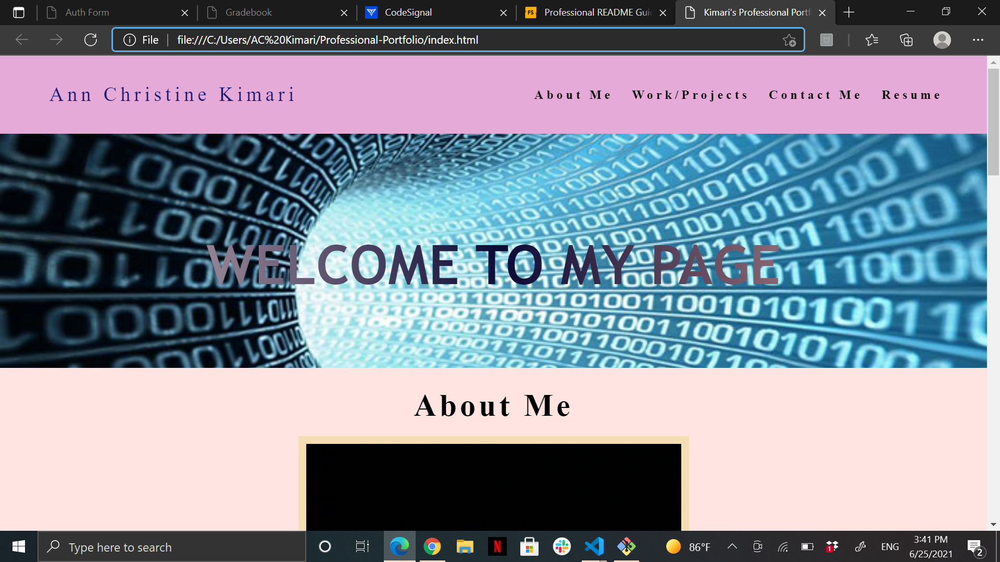

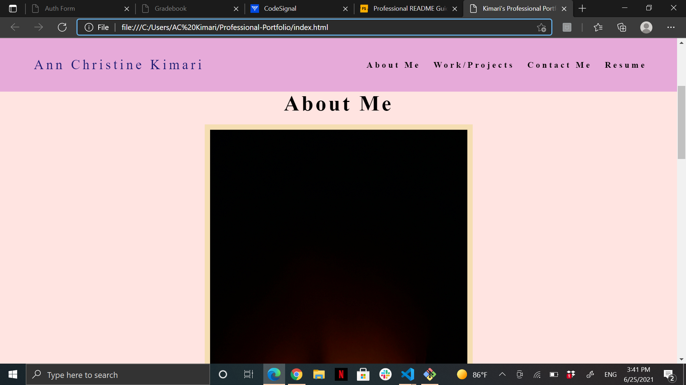

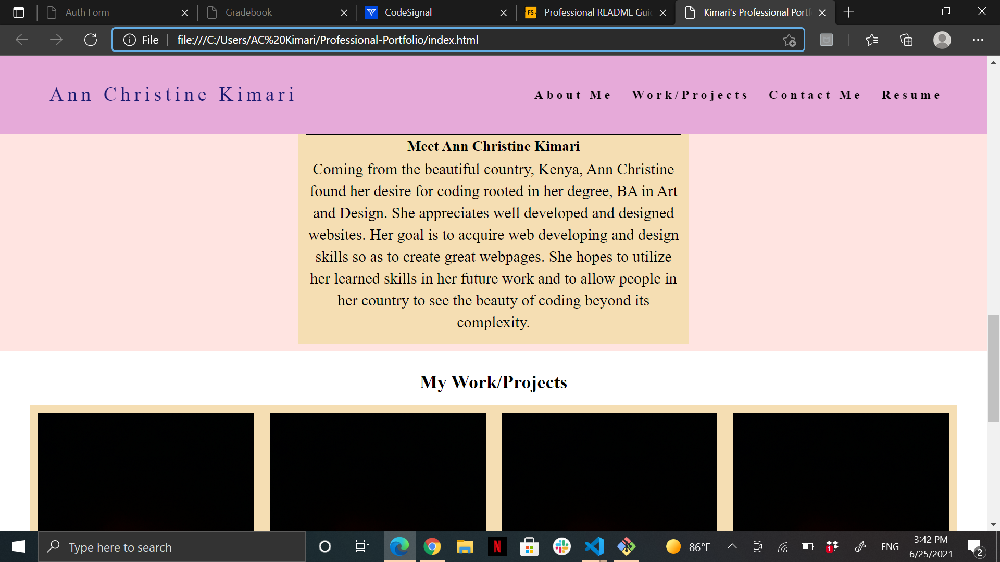

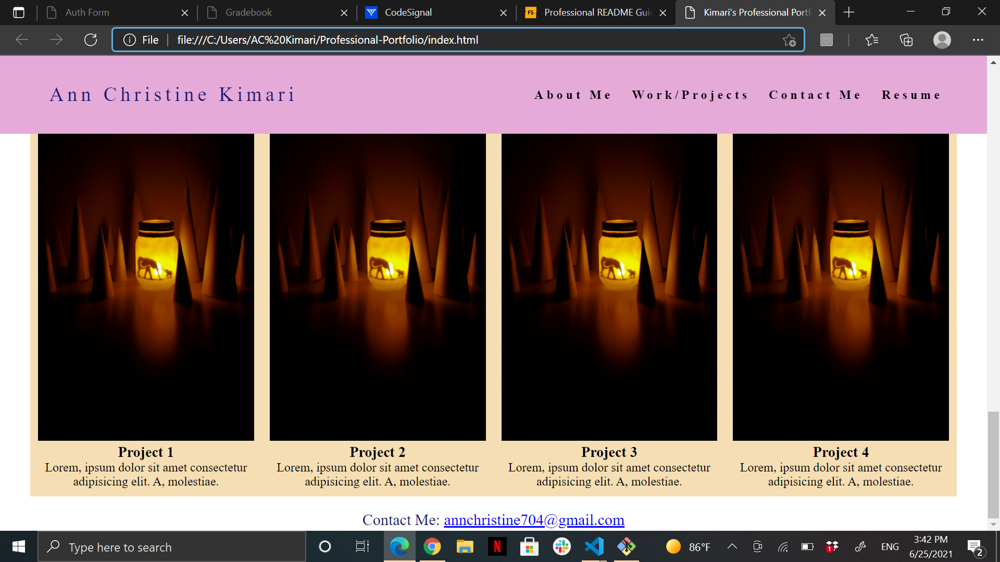

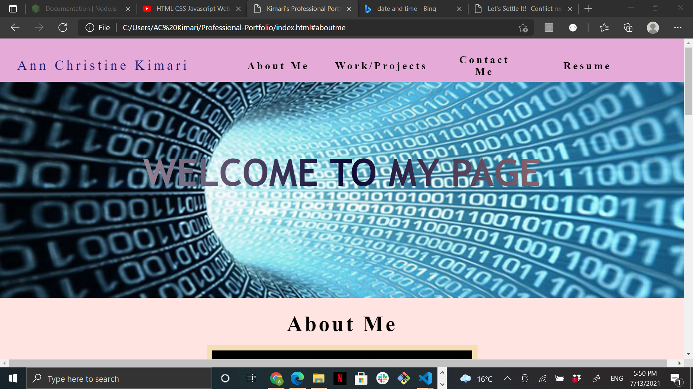

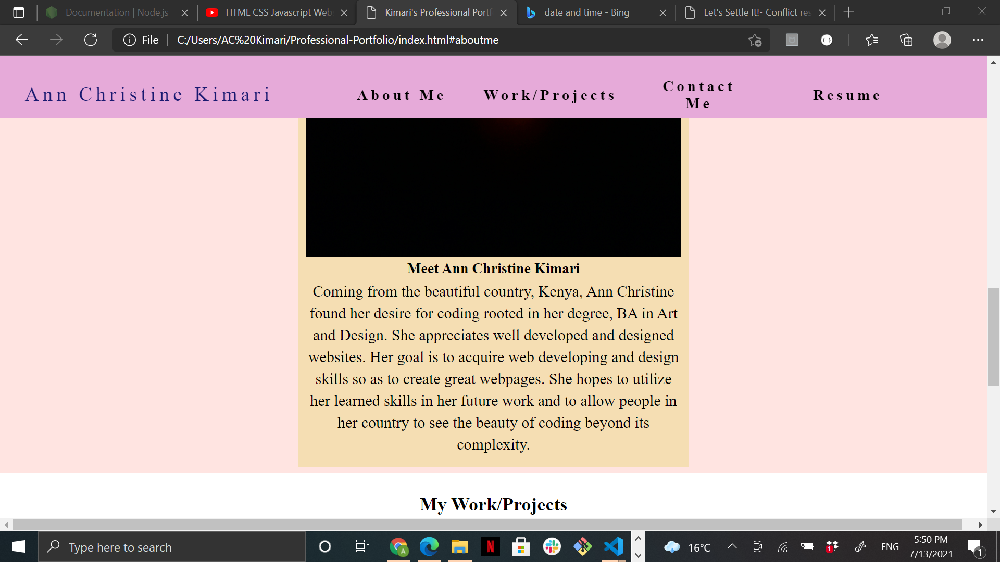

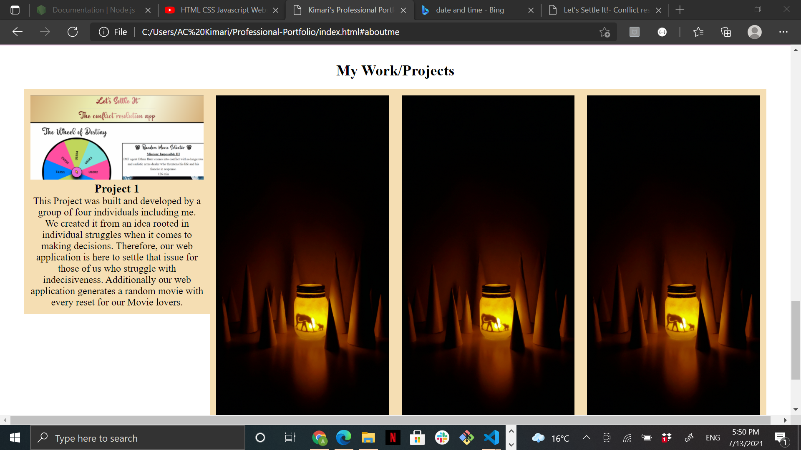

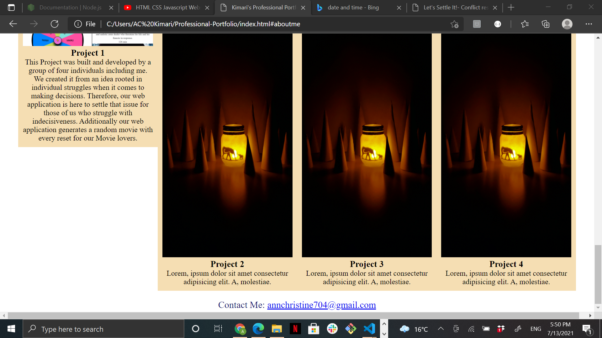

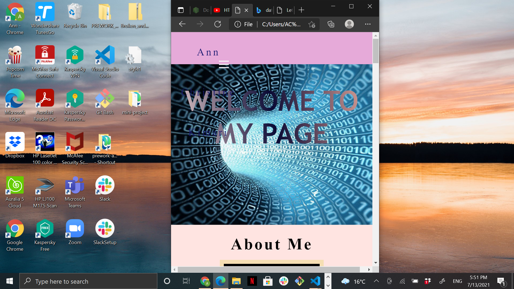

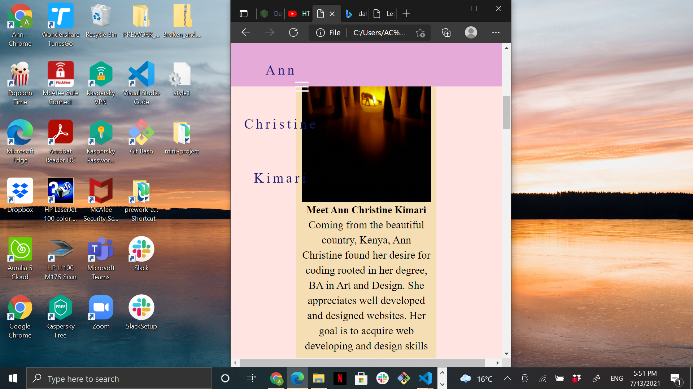

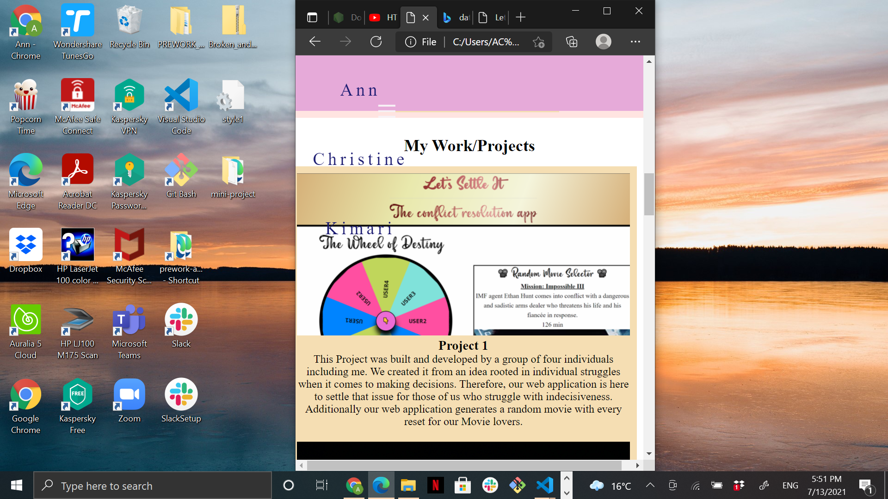

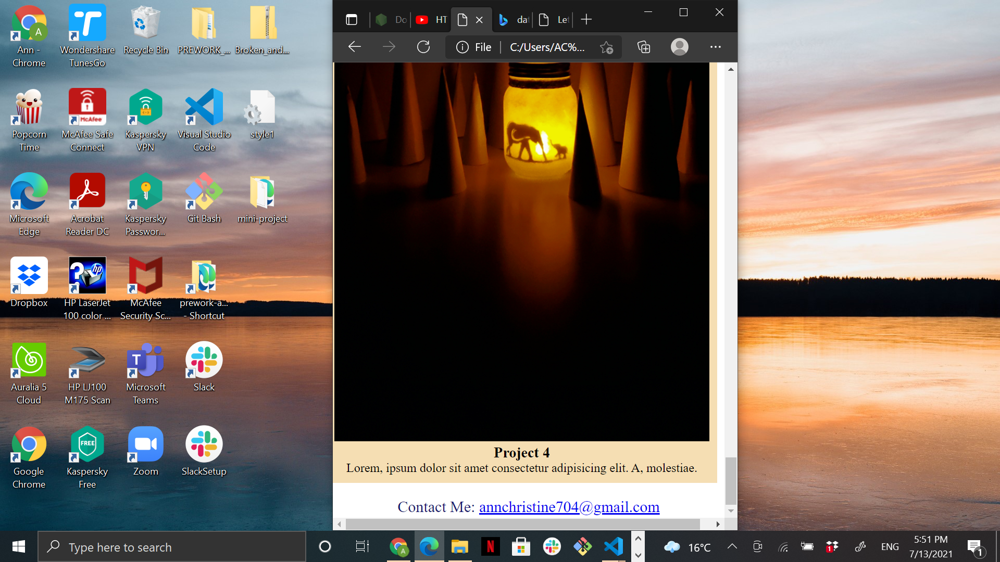